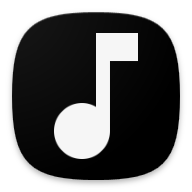

# Local Player 🎵

<p align="center">
  
</p>

<p align="center">
  <strong>Reproductor de música local ligero y moderno para Android</strong>
</p>

<p align="center">
  
  
  
  
</p>

---

## 📱 Características

- **🎵 Reproducción Local**: Accede a tu música sin necesidad de internet
- **📝 Soporte para Letras**: Visualiza letras sincronizadas (formato LRC) mientras reproduces
- **📋 Gestión de Cola**: Organiza y reordena tus próximas canciones con facilidad
- **🔍 Búsqueda Avanzada**: Encuentra tus canciones rápidamente por título o artista
- **🔀 Modos de Reproducción**: 
  - Aleatorio (Shuffle)
  - Repetir una canción
  - Repetir todas
- **📊 Información de Audio**: Visualiza formato (FLAC, MP3, etc.) y bitrate
- **🔄 Detección Automática**: La app detecta automáticamente nuevas canciones agregadas
- **🎨 Interfaz Moderna**: Diseño oscuro con Material Design 3
- **📱 Notificaciones**: Controles de reproducción en la notificación y pantalla de bloqueo
- **🎯 Miniplayer**: Control rápido sin salir de la biblioteca
- **📂 Ordenamiento**: Ordena por título (A-Z, Z-A) o artista

## 📸 Capturas de Pantalla

> _Próximamente_

## 🛠️ Tecnologías

- **Lenguaje**: [Kotlin](https://kotlinlang.org/)
- **UI Framework**: [Jetpack Compose](https://developer.android.com/jetpack/compose)
- **Diseño**: Material Design 3
- **Arquitectura**: MVVM (Model-View-ViewModel)
- **Audio**: Android MediaPlayer
- **Persistencia**: SharedPreferences & JSON Cache
- **Corrutinas**: Kotlin Coroutines para operaciones asíncronas

## 📋 Requisitos

- Android 7.0 (API 24) o superior
- Permisos:
  - `READ_MEDIA_AUDIO` (Android 13+)
  - `READ_EXTERNAL_STORAGE` (Android 12 o menor)
  - `FOREGROUND_SERVICE`
  - `FOREGROUND_SERVICE_MEDIA_PLAYBACK`
  - `POST_NOTIFICATIONS`

## 🚀 Instalación

### Desde Releases

1. Ve a la sección [Releases](https://github.com/cvc953/localplayer/releases)
2. Descarga el archivo APK de la última versión
3. Instala el APK en tu dispositivo Android
4. Abre la app y concede los permisos necesarios

### Compilar desde el código fuente

```bash
# Clonar el repositorio
git clone https://github.com/cvc953/localplayer.git
cd localplayer

# Compilar con Gradle
./gradlew assembleRelease

# El APK se generará en: app/build/outputs/apk/release/
```

## 💡 Uso

1. **Primera ejecución**: 
   - Concede el permiso de acceso a archivos multimedia
   - La app escaneará automáticamente tu biblioteca de música

2. **Reproducir música**:
   - Toca cualquier canción de la lista
   - Usa el miniplayer para control rápido
   - Toca el miniplayer para abrir el reproductor completo

3. **Gestionar cola**:
   - Mantén presionada una canción y arrástrala para reordenar
   - Usa el menú de tres puntos para agregar a la cola

4. **Ver letras**:
   - Coloca archivos `.lrc` con el mismo nombre que tu canción
   - En el reproductor, toca el ícono de letras
   - Las letras se sincronizarán automáticamente

5. **Actualizar biblioteca**:
   - La app detecta automáticamente nuevas canciones
   - También puedes actualizar manualmente desde el menú (⋮ → Actualizar biblioteca)

## 📁 Estructura del Proyecto

```
localplayer/
├── app/
│   ├── src/
│   │   ├── main/
│   │   │   ├── java/com/cvc953/localplayer/
│   │   │   │   ├── model/          # Modelos de datos
│   │   │   │   ├── ui/             # Pantallas Compose
│   │   │   │   ├── viewmodel/      # ViewModels
│   │   │   │   ├── services/       # Servicios de fondo
│   │   │   │   ├── util/           # Utilidades
│   │   │   │   └── MainActivity.kt
│   │   │   ├── res/                # Recursos
│   │   │   └── AndroidManifest.xml
│   │   └── test/
│   └── build.gradle.kts
├── gradle/
├── .github/
│   └── workflows/                  # GitHub Actions
├── README.md
└── build.gradle.kts
```

## 🤝 Contribuir

Las contribuciones son bienvenidas. Por favor:

1. Haz un fork del proyecto
2. Crea una rama para tu feature (`git checkout -b feature/AmazingFeature`)
3. Commit tus cambios (`git commit -m 'Add some AmazingFeature'`)
4. Push a la rama (`git push origin feature/AmazingFeature`)
5. Abre un Pull Request

## 🐛 Reportar Problemas

Si encuentras algún bug o tienes una sugerencia, por favor abre un [issue](https://github.com/cvc953/localplayer/issues).

## 📝 Roadmap

- [ ] Ecualizador integrado
- [ ] Soporte para playlists
- [ ] Widgets para la pantalla de inicio
- [ ] Temas personalizables
- [ ] Escaneo de carpetas específicas
- [ ] Importar/Exportar configuración
- [ ] Soporte para podcasts
- [ ] Sleep timer

## 📄 Licencia

Este proyecto está bajo la Licencia MIT. Ver el archivo [LICENSE](LICENSE) para más detalles.

## 👤 Autor

**Cristian** - [@cvc953](https://github.com/cvc953)

## 🙏 Agradecimientos

- [Material Icons](https://fonts.google.com/icons)
- [Jetpack Compose](https://developer.android.com/jetpack/compose)
- Comunidad de Android

---